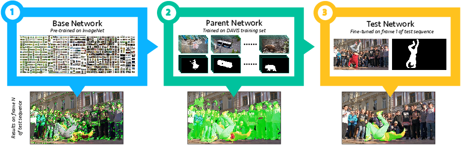

# OSVOS: One-Shot Video Object Segmentation
Check our [project page](http://www.vision.ee.ethz.ch/~cvlsegmentation/osvos) for additional information.


#### This repository was ported to PyTorch 0.4.0!

OSVOS is a method that tackles the task of semi-supervised video object segmentation. It is based on a fully-convolutional neural network architecture that is able to successively transfer generic semantic information, learned on ImageNet, to the task of foreground segmentation, and finally to learning the appearance of a single annotated object of the test sequence (hence one-shot). Experiments on DAVIS 2016 show that OSVOS is faster than currently available techniques and improves the state of the art by a significant margin (79.8% vs 68.0%).


This PyTorch code is a posteriori implementation of OSVOS and it does not contain the boundary snapping branch. The results published in the paper were obtained using the Caffe version that can be found at [OSVOS-caffe](https://github.com/kmaninis/OSVOS-caffe). TensorFlow implementation is also available at [OSVOS-TensorFlow](https://github.com/scaelles/OSVOS-TensorFlow).


### Installation:
1. Clone the OSVOS-PyTorch repository
   ```Shell
   git clone https://github.com/kmaninis/OSVOS-PyTorch.git
   ```
2. Install - if necessary - the required dependencies:
   
   - Python (tested with Anaconda 2.7 and 3.6) 
   - PyTorch (`conda install pytorch torchvision -c pytorch` - tested with PyTorch 0.4, CUDA 8.0 and 9.0)
   - Other python dependencies: numpy, scipy, matplotlib, opencv-python, graphviz.
   - Optionally, install tensorboard (`pip install tensorboard tensorboardx`)
3. Edit the paths in mypath.py

### Online training and testing
1. Download the [parent model](https://data.vision.ee.ethz.ch/kmaninis/share/OSVOS/Downloads/models/pth_parent_model.zip) (55 MB), and unzip it under `models/`, by running:
    ```Shell
    cd models/
    chmod +x download_parent_model.sh
    ./download_parent_model.sh
    cd ..
    ```
2. Edit in file ` train_online.py` the 'User defined parameters' (eg. gpu_id, etc).
3. Run `python train_online.py`.

### Training the parent network (optional)
1. All the training sequences of DAVIS 2016 are required to train the parent model, thus download them from [here](https://graphics.ethz.ch/Downloads/Data/Davis/DAVIS-data.zip).
2. Download the [VGG model](https://data.vision.ee.ethz.ch/kmaninis/share/OSVOS/Downloads/models/vgg_mat.zip) (55 MB) pretrained on ImageNet, and unzip it under `models/`, by running:
    ```Shell
    cd models/
    chmod +x download_vgg_weights.sh
    ./download_vgg_weights.sh
    cd ..
    ```
3. Place the files with the [train](https://github.com/kmaninis/OSVOS-PyTorch/files/1938742/train_seqs.txt) and [test](https://github.com/kmaninis/OSVOS-PyTorch/files/1938743/val_seqs.txt) sequences names in the DAVIS root folder (`db_root_dir()` in `mypath.py`).
4. Edit the 'User defined parameters' (eg. gpu_id) in file `train_parent.py`.
5. Run `train_parent.py`. This step takes 20 hours to train (Titan-X Pascal).

Enjoy!

### Citation:
	@Inproceedings{Cae+17,
	  Title          = {One-Shot Video Object Segmentation},
	  Author         = {S. Caelles and K.K. Maninis and J. Pont-Tuset and L. Leal-Taix\'e and D. Cremers and L. {Van Gool}},
	  Booktitle      = {Computer Vision and Pattern Recognition (CVPR)},
	  Year           = {2017}
	}
If you encounter any problems with the code, want to report bugs, etc. please contact us at {kmaninis, scaelles}[at]vision[dot]ee[dot]ethz[dot]ch.

